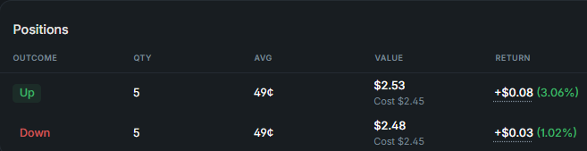
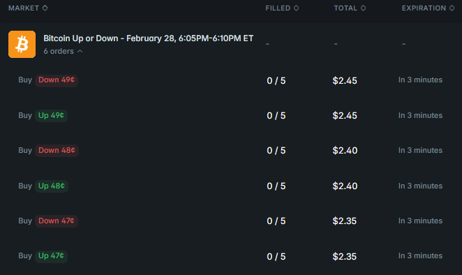
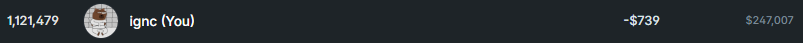

# Polymarkets Up/Down markets
## Intro
Binary up/down markets exist in a wide variety https://polymarket.com/predictions/up-or-down

For sake of the write up I'll limit to the crypto markets

Timeframes for *live* trading:
- 5 min
- 15 min
- 1 hour
- 1 day (24h)

Crypto pairs:
- BTC (by far the most volume)
- ETH
- SOL
- XRP

### Strike
By market start (T_0) a timer will start a countdown. This marks the reference "price to beat" = strike price as per chainlink price feed.

Somewhat later (T_0 + delay) (~30s) the site UI will display the price to beat. If you want to be sure of your strike you will have to scrape this value e.g: threaded worker > webdriver > regex > ... 

You can approximate the strike earlier by logging the very last previous closing price on the chainlink RTDS (see below)

or try a GET request: 
```https://polymarket.com/api/crypto/crypto-price?symbol=BTC&eventStartTime=2026-02-02T19:45:00Z&variant=fifteen```

Mind all GET params: symbol ; eventStartTime (ts as long format string) ; variant = fifteen | five | ?

Combine methods for a fast approximation followed up by a accurate (scraped) strike

Market will stop trading when the timer finishes. It will resolve automatically **based on the chainlink price & strike**

### RTDS (real time data stream)
See: https://docs.polymarket.com/market-data/websocket/rtds

2 data stream exist which you can tap into using a websocket:
- by chainlink (remember this is what is used for auto-resolving markets) 
- by Binance (leading prices)

Assume Binance to be leading the chainlink oracle which has some delay to aggregate data, update the blockchain, etc.

Beware polymarket WS are known for stability issues (aggrevated by VPN usage). So feel free to source your price feeds elsewhere.

### Tips n Tricks
- Pre market cointoss
    - Up/down crypto markets commonly trade around 49/51 cents before any strike price is known. Trading these markets is much more relaxed and a good way to get started. Mind volatility and drift will still impact the pricing of these markets albeit it usually with only a few cents or so. Trades will usually come in a few seconds before the market goes live as bots and traders try to front run the crowd.

    

- Green out the book
    - You can send in multiple orders on a single market (batch order), use this to set orders at multiple price levels. The same order value (min 1 USDC worth) for simplicity, or slightly increase ordersize as you go down the book.

    

- Leaderbord tracking
    - You can easily track your MM volume and profitability using the leaderbord (scroll down): https://polymarket.com/leaderboard/crypto/today/profit could be interesting to log your & progress and rank in volume & PNL

- GTD: good till date
    - Use GTD orders to control when they will expire, e.g: expire 30 seconds before market end. Or expire right as the market goes from pre to live trading (T_0). Minimal expiry delay is 90s as per poly


- PostOnly = True 
    - set when sending in order to ensure you're only making volume (earn MM rebates https://docs.polymarket.com/market-makers/maker-rebates)
 
- Parameters
    - Do not hardcode any numrical variables or parameters controlling the trading system. Export an instance out of a seperate class holding your trading params.


### Terminology
So you want to chat with the big boys on discord... (SO to #devs)

| Term                | Definition                                                                                                   |
|---------------------|--------------------------------------------------------------------------------------------------------------|
| (WS) WebSocket      | A direct, continuous TCP stream between server and client. Beware of timeouts and ping/pong requirements.  |
| (Bid-Ask) Spread    | The price difference between the bid and the ask.                                                           |
| OrderBook        | A list of outstanding buy and sell orders. The live state can be read using a WebSocket connection.        |
| (MM) Market Making  | The practice of quoting both sides of the market, placing buy and sell orders to provide liquidity.        |
| (σ) Volatility      | Often denoted as sigma (σ): the degree of price variation over a given timeframe.                          |
| (BS) Black-Scholes  | An options pricing model used to estimate a fair value based on volatility, time, and other inputs.       |


### Warnings
- Automated trading is an easy way to lose money hands free. Beware of any available balance in your account before executing an automated trading system, a simple bug could blow it all in seconds. Do **NOT** run any unknown code or put your API keys in someone else's app.


### End
Wrote this up from my personal notes but I'm still not profitable myself. 

-739 loss for a volume of 247K or -0.3% 


Feel free to tip me a coffee if you gained value from this writeup.

https://polymarket.com/@ignc 
